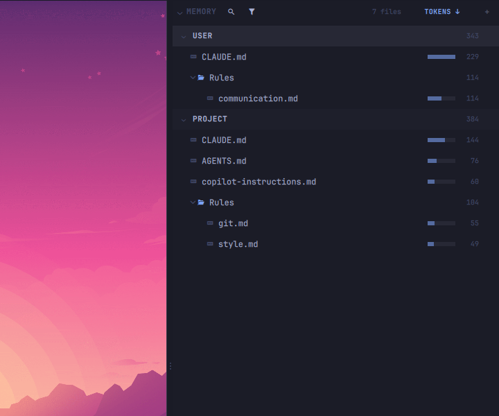
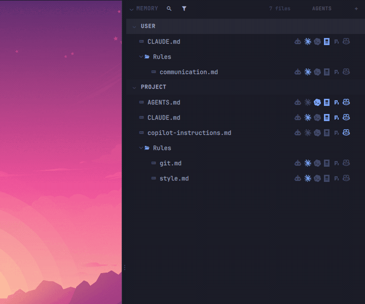

<p align="center"></p>

---

**FileBlade Agent Memory** shows the instructions, rules and memory files your agents load in [FileBlade](https://github.com/data-goblin/fileblade), which gives you IDE-like sidebars for Omarchy. 

<p align="center"></p>

The purpose of this extension is to list the instruction, rule and durable auto-memory files (`CLAUDE.md`, `AGENTS.md`, rule folders and the like) for your installed agents. It supports:
- Codex
- Claude Code
- OpenCode
- Pi
- Copilot CLI
- Antigravity

> [!NOTE]
> Please submit a PR if you want support for other agents.

Agent Memory groups these files by scope and kind in a FileBlade filetree, for the project selected in the file tree. You can use the extension to see which instructions each agent actually loads and to consolidate them by agent: one click on an agent mark links or unlinks a file for that agent through a single symlink.

<p align="center"></p>

## Installation / Quick-start

Until this extension appears in the Omarchy marketplace, install it directly
from GitHub. Requires Omarchy 4.0.2 or later, FileBlade and Python 3.11+. FileBlade includes its
bundled x86-64 Linux binary; no separate extension binary or build is needed.

1. [Install FileBlade](https://github.com/data-goblin/fileblade#installation--quick-start) first.

2. Install and enable this extension:

   ```bash
   OMARCHY_SHELL_IPC_TIMEOUT=10s omarchy plugin add https://github.com/data-goblin/fileblade-memory.git --enable
   ```

3. Restart the shell after installation finishes:

   ```bash
   omarchy restart shell
   ```

4. Select Memory in a FileBlade module slot.

To remove this extension:

```bash
omarchy plugin remove data-goblin.fileblade-memory
omarchy restart shell
```

Removing the extension preserves your files, previous agent configuration
changes and FileBlade's saved state and recoverable bins.

This concise README is human-written to convey the simple intent and purpose of this extension. Full (agent-written) docs are in [docs/agent-written/README.md](docs/agent-written/README.md); design notes in [ARCHITECTURE.md](ARCHITECTURE.md). 

Building your own extension is covered in FileBlade's [EXTENSIONS.md](https://github.com/data-goblin/fileblade/blob/main/EXTENSIONS.md).

### FileBlade Repos

- [FileBlade core](https://github.com/data-goblin/fileblade)
- [Memory](https://github.com/data-goblin/fileblade-memory)
- [Skills](https://github.com/data-goblin/fileblade-skills)
- [MCP](https://github.com/data-goblin/fileblade-mcp)
- [Hooks](https://github.com/data-goblin/fileblade-hooks)

## License

MIT, see [LICENSE](LICENSE).
